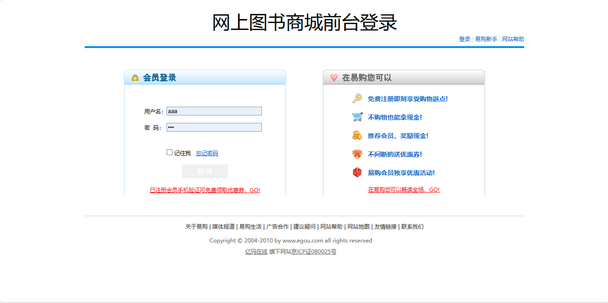
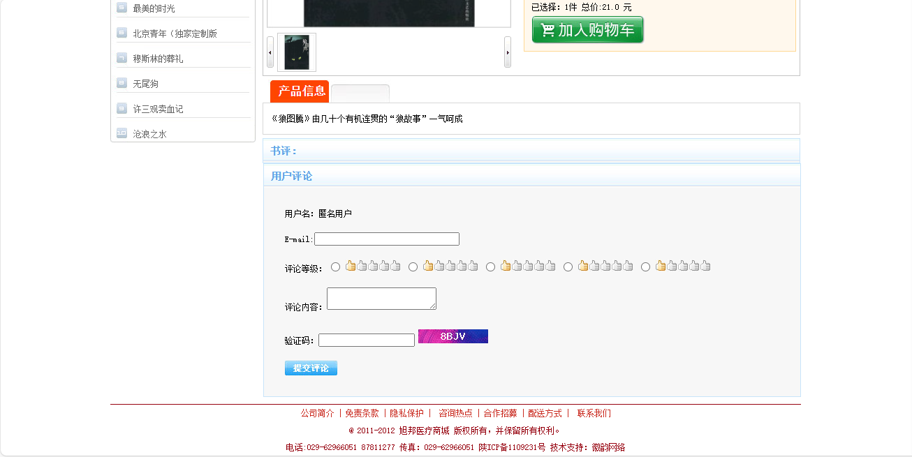
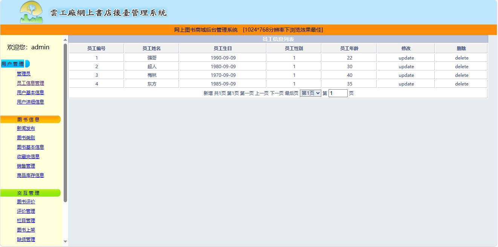
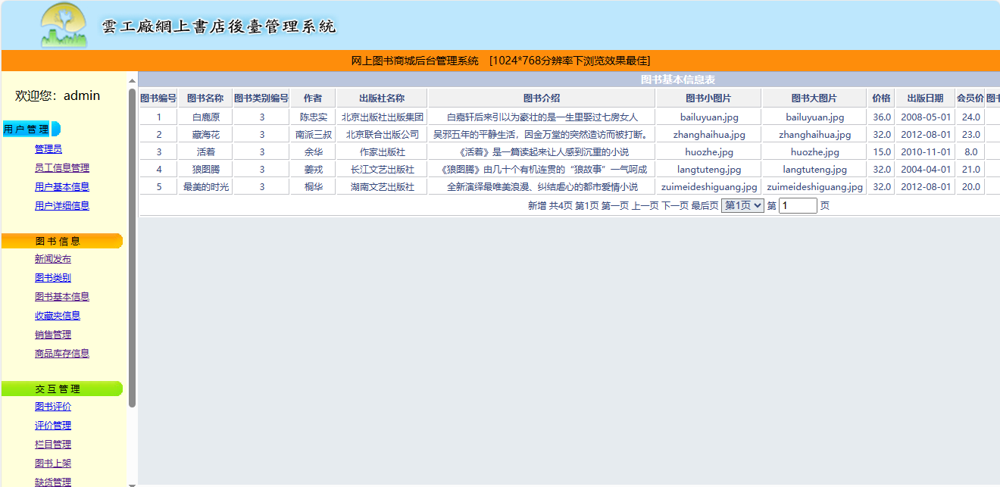

<h1 align="center">41.基于jsp+servlet的网上图书商城管理系统</h1>

 获取sql文件 QQ: 386869957 QQ群: 377586148 

 [推荐站点: 从戎源码网](https://armycodes.com/) 

## 简介

> 本代码来源于网络,仅供学习参考使用!
> 
> 用户端：http://localhost:8080/
> aaa aaa
> 
> 管理端：http://localhost:8080/background/login.jsp
> admin admin
>

## 项目介绍
基于jsp+servlet的网上图书商城管理系统：前端jsp、jquery，后端 servlet、jdbc，集成用户端和管理端、商品浏览、购物车、在线购买、新闻发布、图书类别等功能于一体的系统。

## 功能介绍

### 管理员

- 用户管理：管理员列表、管理员信息修改、管理员信息删除、员工信息列表、员工信息修改、员工信息删除、用户基本信息列表、用户基本信息更新、用户基本信息删除、用户详情
- 新闻管理：新闻发布、新闻列表、新闻编辑、新闻删除
- 图书类别：类别列表、类别修改、类别删除
- 图书信息管理：图书信息列表、图书信息编辑、图书信息删除
- 收藏夹信息：收藏夹列表、收藏夹编辑、收藏夹删除
- 销售管理：销售列表、销售信息编辑、销售信息删除
- 图书评价：评价列表、评价编辑、评价删除

### 用户

- 基本功能：注册、登录、退出
- 商品展示：商品分类展示、轮播图、最新咨询展示、最新商品、热销商品、推荐商品、商品详情、用户评价
- 商品购买：商品加入购物车、购物车列表、提交订单

## 环境

- <b>IntelliJ IDEA 2009.3</b>

- <b>Mysql 5.7.26</b>

- <b>Tomcat 7.0.73</b>

- <b>JDK 1.8</b>

## 运行截图

